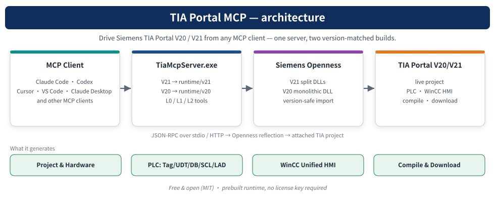

# TIA Portal Openness MCP

[English](README.md) · [文档目录](docs/README.md) · [下载完整包](https://github.com/asckye/TIA_Portal_Openness_MCP/releases/latest)

[](LICENSE) [](https://github.com/asckye/TIA_Portal_Openness_MCP/releases) [](https://github.com/asckye/TIA_Portal_Openness_MCP/actions/workflows/validate.yml)

通过西门子官方 Openness API，让 AI 客户端连接 TIA Portal V20 / V21。包含 MCP 服务、WPF 图形配置器、JSON/YAML 命令行工程生成流程及通用 PLC / WinCC Unified 模板。



完整 ZIP 包含 V20、V21 运行时和依赖。TIA Portal、Openness 和许可证需自行安装；服务端需要 Windows、.NET Framework 4.8，并将运行用户加入 `Siemens TIA Openness` 组，加入后注销重登。

## 从这里开始

从 [Releases](https://github.com/asckye/TIA_Portal_Openness_MCP/releases/latest) 下载 **TIA_MCP_Delivery** ZIP，完整解压，双击根目录 **TiaMcpConfigurator.exe**。

| 使用方式 | 配置步骤 |
|---|---|
| TIA 在虚拟机 | 保持“虚拟机 ↔ 宿主机”模式，在虚拟机填 A 栏：TIA 版本、安装根目录、IPv4、端口和共用密钥，然后“网络权限 → 启动服务”。 |
| AI 在宿主机 | 把配置器 EXE 复制到宿主机，填同一地址、端口和密钥，在 B 栏选客户端，“测试连接 → 写入客户端配置”。宿主机无需安装 TIA。 |
| TIA 与 AI 同机 | 右上角切到“同一台电脑”。A 栏只需版本和目录，客户端经 stdio 自动启动引擎，不用地址、端口和密钥。 |

卡片按 CLI 在前排列：**Claude Code、Codex、Gemini CLI、通义千问（写 Qwen Code）、Kimi（写 Kimi Code CLI）、腾讯元宝（写 CodeBuddy Code）、DeepSeek / 智谱清言 / Grok（写 OpenCode，在其 provider 里选模型）**，其后是 **Cursor、VS Code / Copilot**。国产模型和 Grok 没有自带的 MCP 客户端，卡片按模型命名、实际写入各家官方 CLI 或 OpenCode。官方 Claude 客户端的 **Code** 页面选“Claude Code”。

服务运行时保持配置器窗口打开。保存配置后重启客户端并新建会话。配置位置、权限、备份和客户端差异统一见 [图形配置指南](docs/getting-started/configuration.md)。

## 命令行

在交付包根目录打开 PowerShell，以 V21 为例：

```powershell
.\runtime\v21\TiaMcpServer.exe doctor
.\runtime\v21\TiaMcpServer.exe schema
.\runtime\v21\TiaMcpServer.exe gen .\templates\project-blueprints\scaffold_spec_motor.json --dry-run
```

最后一条仅离线检查 spec；准备创建工程时才去掉 `--dry-run`。V20 改用 `runtime/v20/TiaMcpServer.exe`。更多生成、增量修改、预热及安装目录参数见 [CLI 指南](docs/getting-started/cli.md)。

## 能力与验证范围

当前静态清单共 **447 个工具**，分 7 个大类（会话、工程、PLC 软件、PLC 在线、硬件、HMI、运行时）；默认 **lite** 档直接暴露 **56 个**，其余经 `FindTools` 查找、`CallTool` 调用（`ListToolCategories` 列出分类，`FindTools(category=…)` 按类浏览）。实际列表以运行服务的 `tools/list` 为准，全量暴露需显式使用 `--profile full`。

覆盖工程/会话、PLC 块/类型/变量、硬件网络、Unified HMI、文件交换、库、版本控制及在线只读监视。详细范围见 [工具矩阵](docs/reference/tool-matrix.md) 和 [能力边界](docs/reference/capabilities.md)。实现工具、API 签名检查与真实工程验收是不同状态，不代表覆盖西门子全部 API。

交付版本与引擎版本分别记录。[交付清单](manifest/delivery.json) 绑定引擎及配置器的构建哈希；[验证说明](docs/development/validation.md) 解释各类检查的范围。

## 目录与维护

| 目录 | 用途 |
|---|---|
| [docs](docs/README.md) | 入门、操作、参考、排错、开发及历史记录 |
| [runtime](runtime/README.md) | V20 / V21 固定运行路径及依赖 |
| [tools](tools/README.md) | 引擎源码/测试、AI skill、WPF 源码 |
| [scripts](scripts/README.md) | 构建、检查、生成、诊断和可选操作 |
| [templates](templates/README.md) | PLC/HMI 模板与工程 spec |
| [manifest](manifest/README.md) | 文件清单、版本、验证记录及哈希 |

原根目录配置及启动 CMD/BAT 已由 GUI 替代。交付包不再附带 `bin/Release` 引擎副本，统一使用 `runtime/v20`、`runtime/v21`。调整对照见 [仓库结构说明](docs/development/repository-layout.md)。

开发前阅读 [贡献说明](.github/CONTRIBUTING.md)、[验证说明](docs/development/validation.md) 及 [发布流程](docs/development/release-workflow.md)。变更进入 `master`，用户可见变化记入 [CHANGELOG](CHANGELOG.md)，旧版证据见 [历史发布说明](docs/archive/release-notes.md)。

本项目由 asckye 独立维护，原始来源和依赖声明保留于 [NOTICE](NOTICE.md) 与 [LICENSE](LICENSE)。
