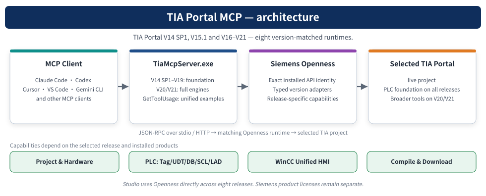

# TIA Portal Openness MCP

[English](README.md) · [新手使用指南](docs/getting-started/beginners.zh-CN.md) · [文档目录](docs/README.md) · [下载完整包](https://github.com/asckye/TIA_Portal_Openness_MCP/releases/latest)

同一个 TIA Portal 工作台提供 **MCP 与客户端** 和 **工程操作** 两个页面，支持中文和英文。配置 AI 连接、启停服务、浏览工程、导入导出和编译均在同一个主窗口内完成。

当前源码已合并桌面界面；已发布的 v3.2.0 ZIP 保留其原来的两个独立界面。使用下述统一界面需要从当前源码构建，等待后续正式版本交付。

## 第一次使用

从 Releases 下载 **TIA_MCP_Delivery** ZIP，完整解压到较短的固定目录。GitHub 的 `Source code` 压缩包只含源码。

交付包只包含运行文件、用户文档、模板、Claude Code 插件及生态资源；开发源码、构建脚本和验证工具保留在源码仓库。

- **用 AI 操作：**双击 `TiaOpenness.exe`，在 **MCP 与客户端** 页面选择实际安装的 TIA 版本和“同一台电脑”或“虚拟机 ↔ 宿主机”，选择实际使用的 MCP 客户端，写入配置后重启客户端并新建会话。
- **自己操作：**打开同一个 `TiaOpenness.exe`，切换到 **工程操作**，连接前选择顶部的 TIA 版本，连接工程后选择目标 PLC。Studio 直接调用 Openness，无需配置 MCP。
- **先看演示：**在包根目录运行 `TiaOpenness.exe --mock --lang zh`。演示使用模拟数据。

按[新手使用指南](docs/getting-started/beginners.zh-CN.md)完成安装、连接和第一个 SCL 导入编译练习；具体客户端配置见[配置指南](docs/getting-started/configuration.md)。

## 版本和工具

| TIA 版本 | 注册工具数 | MCP 实现 |
|---|---:|---|
| V14 SP1 | 57 | PLC 基础引擎 |
| V15.1 | 58 | PLC 基础引擎 |
| V16 / V17 / V18 | 各 60 | PLC 基础引擎 |
| V19 | 62 | PLC 基础引擎 |
| V20 | 477 | 完整引擎 |
| V21 | 488 | 完整引擎 |

V20/V21 默认 lite 档显示 63 个常用工具，其余通过 `FindTools` 查找、`CallTool` 调用，也可配置 `--profile full`。旧版本直接显示各自的基础目录，参数和返回值可能不同。准确范围见[逐版本工具说明](docs/reference/version-tools.md)及当前服务的 `tools/list`。V14 SP1、V15.1 不等于原版 V14、V15。

AI 调用不熟悉的工具时，用 `GetToolUsage(toolName, operation)` 获取本版参数、示例和结果解释；用 `language` 查编程语言示例，用 `exampleId` 取完整源码或调用序列。全部工具共用这套示例入口，官方 API 模式与本项目封装示例分别标明。

## 环境与验证

按需安装对应版本的 TIA Portal、Openness 和许可证。统一桌面和基础引擎所需的 .NET 10 运行时已随包附带（`runtime/dotnet`）；Openness 桥接进程、工作进程及完整引擎需要 .NET Framework 4.8（Windows 10 1903 及以后已自带）。具体文件位置见[运行目录](runtime/README.md)。

八版本运行文件、Studio、协议、离线功能和官方 SDK/XSD 检查已有构建记录；新增功能的真实 TIA 工程验收仍为 **NOT RUN**。工具数量不等于完整覆盖所有 Siemens API，当前范围见[能力与验收说明](docs/reference/capabilities.md)。

## 开发和维护

仅维护 `master`。运行二进制随完整 Release 分发，不提交到 Git。准备 SDK 和伴随 Python 环境后，使用 `Build-MultiVersion.ps1 -Test` 构建全部版本。

[构建与验证](https://github.com/asckye/TIA_Portal_Openness_MCP/blob/master/docs/development/validation.md) · [发布流程](https://github.com/asckye/TIA_Portal_Openness_MCP/blob/master/docs/development/release-workflow.md) · [当前交接](https://github.com/asckye/TIA_Portal_Openness_MCP/blob/master/docs/development/handoff.md) · [变更记录](CHANGELOG.md) · [第三方许可证](docs/licenses/THIRD-PARTY-NOTICES.md)
