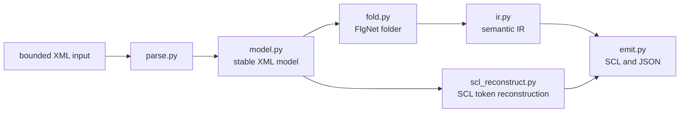
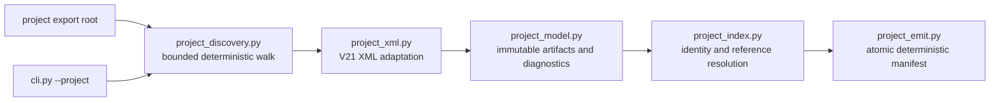

# Architecture

This document describes the current `simaticml-decoder` architecture: block decoding, project
indexing, filesystem and input-safety boundaries, deterministic outputs, and the evidence used to
make capability claims.

## 1. Product boundary

The decoder is an offline analysis tool for already-exported TIA Portal artifacts. It does not
attach to TIA Portal, invoke Openness, compile PLC software, write a TIA project, or promise that
its output can be imported back into TIA Portal.

There are two public processing modes:

- block mode decodes one exported block XML file, or a directory of independent block XML files,
  into readability-first SCL and/or JSON sidecars;
- project mode discovers a V21 export tree, adapts recognized XML artifacts, resolves conservative
  block and UDT references, and writes one analysis-only `project-manifest.json`.

The modes share hardened discovery and XML boundaries but have different outputs and failure
contracts. See [PROJECT_INPUT_CONTRACT.md](PROJECT_INPUT_CONTRACT.md) for normative project-mode
behavior.

## 2. Block decode pipeline

### Parse and stable model

`parse.py` turns bounded XML into the typed syntax model in `model.py`. The model retains XML-facing
identity such as `UId`, programming language, interface sections, parts, calls, accesses, wires,
comments, and attributes needed for later diagnostics. Unknown source data is preserved where the
model has an explicit preservation field; it is not silently interpreted as executable logic.

### Fold and semantic IR

`fold.py` indexes the `FlgNet` graph, resolves driver/sink relationships, and folds supported LAD
and FBD forms into the expression and statement types in `ir.py`. `instructions.py` is a catalog of
known part shapes and pin vocabularies; it does not by itself prove that an instruction is
semantically qualified.

The folder keeps source identifiers on emitted IR and returns visible `Unhandled` values and
warnings when it cannot justify a translation. Readability and traceability take precedence over
producing plausible-looking SCL.

### Emit and SCL reconstruction

`emit.py` renders readability-first SCL and a JSON sidecar containing interface data, instruction
inventory, warnings, cross-references, and source trace information. Native SCL compile units take
a separate reconstruction path through `scl_reconstruct.py`; they are not folded as `FlgNet`.

Output is analysis-only. Formatting, diagram layout, and importable source fidelity are outside the
current contract.

## 3. Project-index pipeline

`project.py` orchestrates the pipeline without widening the single-block parser's public contract.
Recognized V21 blocks and PLC types become immutable project artifacts. Unsupported artifact kinds,
non-V21 exports, missing versions, malformed inputs, and unresolved or ambiguous references remain
visible as structured diagnostics instead of aborting unrelated artifacts.

Resolution is conservative: an edge is emitted only when the target identity is unique under the
documented origin and path rules. Duplicate, ambiguous, and unresolved relationships are reported
deterministically. Cycles remain represented as ordinary edges and do not produce a dedicated
diagnostic.

`project_emit.py` writes the manifest through a temporary file and atomic replacement. The manifest
contains POSIX-normalized root-relative paths and declares its analysis-only, non-re-importable
output contract.

## 4. Filesystem and untrusted-input boundary

All input is untrusted. Block and project discovery share the policies in `input_policy.py`:

- bounded file size, tree depth, file count, XML element count, XML depth, text, attributes, and
  `FlgNet` counts;
- DTD/entity rejection and bounded, sanitized diagnostics;
- deterministic path ordering and per-artifact failure isolation;
- no fallback from secure traversal to ordinary path re-resolution.

On Windows, `windows_handles.py` opens the root once, enumerates children through native handles,
and rejects reparse points. On POSIX, discovery uses descriptor-relative operations and
`O_NOFOLLOW`. A platform without the required primitives rejects directory input rather than
weakening the boundary.

Single-block/directory input may discover SIMATIC SD files so the tool can report their unsupported
or unpaired state, but their content is not parsed by a SIMATIC SD adapter today. Project mode
discovers XML files only; it does not currently inventory SIMATIC SD files.

## 5. Determinism and partial success

Discovery order, identities, reference edges, diagnostics, cross-references, and serialized
manifests are stable for unchanged input and configuration. Batch and project processing isolate
malformed or unsupported artifacts so useful independent results survive.

Partial success is explicit. Project artifacts use `complete`, `partial`, `preserved`, or `failed`
status, with structured diagnostics for every non-complete result. A failure to record an artifact
or write the manifest still produces a non-zero process result.

## 6. Evidence model

The repository distinguishes implementation evidence from format qualification:

- unit tests prove focused parser, folder, emitter, resolver, and policy behavior;
- integration tests prove the CLI and deterministic project pipeline against tracked fixtures;
- a native-format support claim additionally requires a representative, sanitized,
  redistributable fixture with provenance, expected output, and a non-skipping CI regression;
- manual inspection or an untracked production export may guide development but does not qualify a
  format.

The current status is maintained in [CAPABILITIES.md](CAPABILITIES.md). Dated plans and reports in
[`superpowers/`](superpowers/README.md) explain historical decisions but are not current behavior
authorities.
