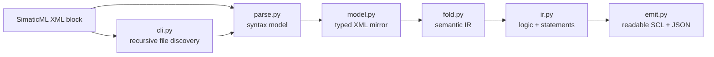

# simaticml-decoder — Project Capability Assessment

> **Historical snapshot (2026-07-13).** Later commits implemented explicit project mode, raised
> the quality gate, and expanded tests. The assessment below is preserved as the planning baseline,
> not current behavior documentation. See the [architecture](ARCHITECTURE.md),
> [current capabilities](CAPABILITIES.md), and [roadmap](../ROADMAP.md).

**Status:** planning baseline, 2026-07-13
**Scope:** current-state assessment only. This document makes no implementation changes or support claims beyond the evidence recorded below.

## Executive conclusion

The existing decoder is a sound block-level compiler pipeline with a useful extension seam: XML syntax is kept separate from semantic folding and output rendering. It already processes recursive **directories of independent XML block exports**, but it is not yet a project translator.

The lowest-risk next capability is to qualify native FBD fixtures through the existing `FlgNet` path. GRAPH and SIMATIC SD/YAML-like inputs require separate front ends and should not be added as instruction-catalog entries. Large-project support requires a project-index layer above the current single-block parser.

## Evidence and document authority

Source code, tracked tests, and CI configuration are the authority for this assessment. The local `SIMATICML_READING_GUIDE.md`, `IMPLEMENTATION_PLAN.md`, and root `PLAN.md` contain useful reference material, but parts of them describe already-completed work as future work. They are not tracked in the current repository state.

This assessment, the companion [advanced translation roadmap](ADVANCED_TRANSLATION_ROADMAP.md), its [acceptance criteria](ADVANCED_TRANSLATION_ACCEPTANCE_CRITERIA.md), and the implementation plans under `docs/superpowers/plans/` are deliberately made trackable under `docs/`. Existing local documents, samples, and fixtures remain ignored.

## Current architecture

The separation is real, not merely planned:

- `parse.py` produces a typed, mostly lossless XML-facing model.
- `fold.py` turns a `FlgNet` wire graph into a semantic IR and retains visible `Unhandled` diagnostics rather than silently omitting unfamiliar parts.
- `emit.py` produces readability-first SCL and a JSON sidecar with interface data, warnings, instruction inventory, cross-references, and source trace data.
- `cli.py` performs deterministic XML file discovery and batch output.

The graph report identifies `_NetFolder`, XML parsing helpers, and `_parse_block` as high-coupling points. The report is stale (`dcc027e5` versus current `aa35cdb`), so source and tests were used for detailed findings.

## Capability matrix

| Input or capability | Parse fidelity | Semantic translation / output | Validation evidence | Planning status |
| --- | --- | --- | --- | --- |
| LAD `FlgNet` | Typed `FlgNet` model | Folded IR, readable SCL, JSON sidecar | Two tracked LAD fixtures and non-skipping tests | Established baseline |
| FBD / FBD_IEC `FlgNet` | Mapped to `Language.FBD`; uses the same `FlgNet` path as LAD | Uses the existing folder without an FBD-only branch | No native FBD fixture or test | Architecturally plausible; **not validated** |
| SCL `StructuredText` | Tokenized source parsed | Reconstructed text, not graph-folded | Rich fixture tests exist but skip without the ignored sample corpus | Partially implemented; corpus gap |
| STL `StatementList` | Retained as `RawSource` | Deferred warning only | No fixture | Preserved in parser only |
| GRAPH `Graph` | Retained as `RawSource` | Deferred warning only | No fixture | Preserved in parser only |
| OB / DB block kinds | Identified as block kinds | Generic network handling; no dedicated semantic model | Limited corpus evidence | Needs explicit scope and fixtures |
| Recursive XML folders | Case-insensitive, sorted `.xml` discovery; path mirroring; per-file parse errors isolated | Serial per-file decode | CLI tests, subject to missing rich fixtures | Established file-tree batch mode |
| Project dependency traversal | No manifest, cross-block resolver, library model, or call graph | N/A | Not present | New architectural capability |
| YAML-like Siemens inputs | No input detection, parser, schema, fixtures, or tests | N/A | No local evidence | Define the exact format first |

## Current LAD/FBD semantic coverage

The seeded instruction catalog covers 29 named parts across contacts/coils, OR, comparisons, edge detection, RS/SR latches, arithmetic and move boxes, IEC timers, and one system FC. The folder already preserves an unfamiliar part as an explicit warning/`Unhandled` result.

This is a good safety property, but it is not a broad language guarantee. Some catalog rows are inferred from naming patterns rather than demonstrated by committed fixtures. Advanced translation must remain corpus-driven: confirm pin names, negation, EN/ENO behavior, ordering, instance behavior, and expected side effects before marking a part supported.

## Recursive batch processing versus project processing

Current recursion is intentionally narrow:

- It walks a filesystem tree and filters `.xml` files.
- It sorts input paths deterministically and mirrors subdirectories under the output root.
- It handles one parsed `Document.block` at a time.
- It materializes the entire source list and result list, then processes files serially.

It does **not** discover a TIA project, resolve calls between blocks, distinguish libraries from user blocks, create stable project-wide identities, or report a project dependency graph. Treat directory recursion as a batch convenience rather than evidence of project translation.

## Scale, reliability, and input-safety gaps

The per-network folder memoizes values and detects in-progress wire-graph cycles. That is a useful base for correctness, but the current implementation has no documented resource policy for large or untrusted inputs:

- no file-size, XML-depth, element-count, or graph-node limits;
- no traversal budget, symlink policy, bounded concurrency, cancellation, checkpoint, or resume behavior;
- recursive semantic evaluation can remain call-stack-bound on deep acyclic graphs;
- unexpected fold or emit exceptions are not isolated in the same way as XML parse errors;
- multi-artifact output is not atomic, so a failed second write can leave a partial block result.

These are roadmap requirements for project-scale work, not claims of a current defect in ordinary block exports.

## Quality baseline

The local verification run on 2026-07-13 produced:

| Check | Result |
| --- | --- |
| Ruff | `ruff check src tests` passed |
| Pytest | 43 passed, 11 skipped |
| Coverage | 76.87% total |
| Current CI gate | 70% total coverage on Python 3.11 and 3.12 |
| Project target from `AGENTS.md` | at least 80% coverage |

The most relevant coverage gaps for the roadmap are `scl_reconstruct.py` (19%), `cli.py` (62%), and `fold.py` (65%). The fresh-clone fixture corpus contains only `InvertBit.xml` and `SimpleDevice.xml`; `Motor`, `SingleAlarm_FB`, and `FB_SYSTEM` live only in ignored local documentation material. As a result, eight CLI tests and three richer regression tests skip in a fresh clone.

## Documentation and corpus debt

- `docs/IMPLEMENTATION_PLAN.md` describes the parser, folder, emitter, CLI, and tests as mostly incomplete although the source now implements them.
- Root `PLAN.md` describes recursive batch processing as future work although it is implemented.
- `tests/conftest.py` says the fixture directory is gitignored, but two fixtures are tracked.
- Most local `docs/` material remains ignored by Git; the assessment, roadmap, acceptance criteria, and implementation plans are explicit tracked exceptions and form the durable planning record.

The roadmap therefore starts with a versioned corpus and support-claim policy. Until that exists, use the labels **validated**, **preserved only**, and **unsupported** rather than a single broad “supported” status.

## Confirmed planning inputs

1. **Project input:** a TIA Portal project export consisting of UDTs and blocks, including blocks supplied by the project library. The project layer must index both executable blocks and type definitions; it must not treat library blocks as invisible external calls.
2. **Compatibility:** TIA Portal **V21** only. CPU family is not a compatibility dimension for this roadmap.
3. **YAML-like input:** **SIMATIC SD**. The target is a V21 SD collection containing `.s7dcl` code files and, where multilingual resources exist, optional `.s7res` files; it is not generic YAML.
4. **Fixture production:** one small representative project will be exported separately as SimaticML and SIMATIC SD. The corpus must model the two export roots as related inputs, not assume a combined export is possible.
5. **GRAPH:** deferred beyond the immediate FBD, project-ingestion, and SIMATIC SD work. Its approved future direction remains a traceable JSON state-machine representation.
6. **Re-importability:** out of scope for the current roadmap. It remains a future, version-specific compatibility direction rather than an implicit output promise.

## Decisions still needed

1. Apply the approved output-fidelity contract: readability-first FBD SCL plus JSON, deferred GRAPH state-machine JSON/visualization, and SIMATIC SD preservation plus normalized analysis.
2. Provide a sanitized, versioned fixture corpus. This means native example exports that can be committed and exercised in CI, not merely synthetic test snippets: the separate SimaticML and SIMATIC SD roots for the small project, with UDTs, user blocks, library blocks, nested paths, focused FBD, SCL, STL, advanced-call, and DB/UDT/OB examples. GRAPH can join a later corpus expansion.

See [ADVANCED_TRANSLATION_ROADMAP.md](ADVANCED_TRANSLATION_ROADMAP.md) for the proposed sequencing and evidence gates.
