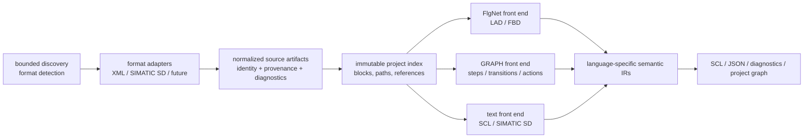

# simaticml-decoder — Advanced Translation Roadmap

**Status:** Active roadmap. Approved 2026-07-13; progress reconciled 2026-08-09.

**Current position:** the immediate serial project-ingestion subset is delivered. The evidence
corpus is not yet suitable for public qualification, native FBD qualification remains incomplete,
advanced `FlgNet` work is partial, SIMATIC SD parsing has not started, and GRAPH remains deferred.

**Scope:** feature direction and verification policy. Detailed implementation is authorized only
through separately approved plans or direct user instruction.

## Outcome sought

Evolve the decoder from a reliable translator of individual SimaticML `FlgNet` blocks into a format-aware, project-scale analysis tool while preserving the existing readability-first SCL and JSON outputs.

The target project input is a **TIA Portal V21 project export** containing UDTs and blocks, including blocks supplied by the project's library. CPU family is deliberately out of scope. SIMATIC SD is the confirmed YAML-like input target; its collection contains `.s7dcl` code files and optional `.s7res` multilingual-resource files.

The immediate plan covers three directions:

1. qualify FBD and expand advanced `FlgNet` block support;
2. ingest large nested export sets as coherent projects rather than unrelated files;
3. support the specifically identified Siemens YAML-like format without guessing its dialect.

GRAPH is intentionally deferred. Its approved future direction is a state-machine-aware JSON/visual representation, not a near-term FBD extension or pseudo-SCL renderer. Re-importability is also out of scope for the current roadmap and remains a future version-specific compatibility initiative.

## Options considered

| Approach | Benefits | Costs / risks |
| --- | --- | --- |
| One universal IR before adding formats | A theoretically uniform model | Large up-front redesign; likely distorts GRAPH and text formats to fit the current boolean IR |
| Direct parser-to-emitter implementation per format | Fast visible output for one format | Duplicates semantics, loses cross-format traceability, and makes project-level analysis harder |
| **Staged adapters around a canonical project index and language-specific IRs** | Preserves the proven XML → model → IR → emit seam; supports evidence-gated delivery | Requires explicit contracts and a small project layer before broad scale claims |

**Recommendation:** use staged adapters. Keep the current `FlgNet` folder as the LAD/FBD front end, add a project index above it, and give GRAPH its own semantic IR. Do not force GRAPH or SIMATIC SD through the boolean statement IR.

## Target architecture

### Architectural rules

- Keep input-format parsing, semantic translation, and emitting separate.
- Treat all discovered input as immutable. Adapters create normalized records rather than mutating parser objects.
- Give every artifact a stable qualified identity, source location, format/dialect/version, and structured diagnostics.
- Preserve unrecognized content losslessly where feasible; never invent a semantic translation.
- Keep project indexing independent from single-block parsing so existing CLI behavior remains compatible.
- Make partial success explicit: a project may contain valid results, preserved-only artifacts, and failed artifacts at the same time.

## Phase 0 — Evidence and compatibility contract

**Current status: Partial.** A tracked manifest, separate SimaticML/SIMATIC SD roots, cross-format
mapping, golden diagnostics, hardened input policy, and non-skipping corpus-integrity tests exist.
The current upstream corpus has no declared license, is not redaction-reviewed, is marked
`local-evaluation-only`, and therefore does not qualify formats for public support.

**Purpose:** eliminate unsupported support claims before new parser work.

Create and version a sanitized fixture corpus with provenance metadata:

- TIA version (V21), export method, and schema/dialect;
- source format and expected output fidelity;
- license/redaction status;
- expected semantic IR, SCL/JSON/diagnostic golden outputs;
- a capability label: `qualified`, `implemented-not-corpus-qualified`, `preserved-only`, or
  `unsupported`.

The corpus means **native, sanitized example exports committed with the tests**, rather than invented XML fragments alone. The initial corpus comes from one small V21 project exported separately into a SimaticML root and a SIMATIC SD root; no test assumes TIA can produce a combined export. One authoritative cross-format mapping manifest, stored beside the two roots, identifies shared UDTs, user blocks, and project-library blocks without requiring identical file layouts or one-to-one source files. The SD root must include one valid code-only `.s7dcl` case, one resource-backed `.s7dcl`/`.s7res` case, and one unpaired-resource diagnostic case. Focused fixtures then isolate FBD, SCL, STL, advanced calls, and DB/UDT/OB artifacts. GRAPH belongs to a later corpus expansion.

Document an input policy for untrusted data: file and traversal limits, XML/`FlgNet`/call-reference complexity limits, SIMATIC SD parser complexity limits, symlink policy, malformed-input behavior, and diagnostics redaction. `GRAPH` is not an immediate complexity target because GRAPH itself remains deferred.

**Exit gate:** no feature moves to “supported” without committed representative input, expected output, CI execution, and a non-skipping regression test.

## Phase 1 — FBD qualification

**Current status: Not complete.** FBD/FBD_IEC use the shared production `FlgNet` path and focused
unit behavior exists, but no committed XML fixture declares FBD or FBD_IEC. The native fixture,
semantic-golden, and end-to-end qualification gates remain open.

FBD is not a separate XML-netlist implementation in the current architecture: `FBD` and `FBD_IEC` are mapped to `Language.FBD`, then use the same `FlgNet` parser and folder as LAD. This is a promising reuse opportunity, but the present test corpus contains no native FBD export.

Qualify it before expanding behavior:

1. collect native FBD and FBD_IEC exports, including mixed-language blocks;
2. compare pin names, negation, fan-out, EN/ENO threading, multi-output boxes, instance calls, and execution-order expectations against LAD assumptions;
3. add golden semantic-IR and output tests, not only string snapshots;
4. classify instruction catalog rows as confirmed, inferred, or unsupported;
5. publish the supported FBD subset and visible fallback behavior.

**Exit gate:** FBD gets a `qualified` label only after CI runs representative non-skipping fixtures for simple signal flow, function/FB calls, EN/ENO, timers, edge behavior, comparison/math boxes, and mixed LAD/FBD compile units.

## Phase 2 — Advanced `FlgNet` blocks

**Current status: Partial.** Focused implementation and tests cover additional AND/OR behavior,
per-pin negation, and the F-system boxes ACK_GL/ESTOP1/SFDOOR/FDBACK. Those additions do not satisfy
the phase exit gate because their representative sanitized native fixtures and end-to-end goldens
are absent.

Extend LAD/FBD semantics only from observed source material. Prioritize:

- advanced access paths, arrays, bit slices, UDT and DB addressing;
- multi-instance and external/user/library calls;
- complex EN/ENO and multiple-output behavior;
- advanced timers, counters, arithmetic, conversion, and diagnostic instructions;
- OB, FB, FC, DB, and UDT declarations with explicit non-executable versus executable semantics.

Each new construct needs its own fixture, semantic expectation, source trace, renderer policy, and negative/unsupported case. A visible `Unhandled` diagnostic remains preferable to plausible but wrong SCL.

**Exit gate:** every claimed instruction has a committed native sample and an end-to-end test; emitted diagnostics distinguish unknown instruction, known-but-unsupported form, missing reference, and malformed input.

## Phase 3 — Project ingestion and large-scale traversal

**Current status: Immediate subset delivered.** The repository now has an immutable project model,
bounded deterministic discovery, V21 XML adaptation, conservative block/UDT reference resolution,
an explicit `--project` CLI mode, and atomic deterministic manifest output. CI exercises the
tracked project corpus without fixture-related skips.

Concurrency, streaming, cancellation, checkpoints/resume, duration and peak-memory budgets, and
broader aggregate analysis remain follow-on scale work.

Retain the current recursive XML CLI mode as a compatibility path. Add a **separate** project-ingestion layer that turns a collection into a stable project index.

The project index must define:

- deterministic discovery and ordering across nested paths;
- include/exclude rules, symlink policy, format sniffing, and collision handling;
- qualified block identity, namespaces/libraries, declaration metadata, and call/reference edges;
- unresolved/ambiguous reference diagnostics without aborting unrelated blocks;
- bounded concurrency, memory, file-count, depth, and wall-time policies;
- streaming or chunked results, cancellation, checkpoints/resume, and a project manifest;
- aggregate outputs: project inventory, call graph, resolution summary, and per-artifact status.

The immediate implementation is deliberately narrower: serial, bounded, deterministic discovery; per-artifact failure isolation; and a recoverable project manifest. Concurrency, streaming, cancellation, and checkpoints/resume remain follow-on scale milestones and are not current acceptance gates.

**Exit gate:** a multi-directory corpus proves deterministic manifests and reference resolution, preserves source provenance for every diagnostic, isolates both expected and unexpected per-artifact failures according to a documented policy, and meets published scale budgets.

## Future direction — GRAPH front end

**Current status: Deferred.** No current support or delivery claim is made.

GRAPH is intentionally deferred because the immediate project scope prioritizes the more widely used LAD/FBD and SIMATIC SD paths. It is sequential control, not a `FlgNet` variant: its semantics include initial steps, transitions, actions, qualifiers/events, jumps, and alternative/parallel branches. The existing boolean expression and statement IR is therefore insufficient.

Introduce a separate typed model and state-machine-oriented IR with at least:

- chart identity, initial/active steps, and source traceability;
- steps, actions, qualifiers, transitions, and their conditions;
- alternative and parallel branches, joins, jumps, and unsupported nodes;
- deterministic execution/ordering semantics and structured diagnostics.

When scheduled, the first deliverable should be a lossless JSON/analysis or visualization-oriented output. Do not emit pseudo-SCL that looks executable until the intended control-flow semantics are verified against native examples.

**Future exit gate:** fixtures cover sequential flow, transitions, action qualifiers, alternative and parallel branching, jumps, nested/embedded conditions, and unsupported constructs. Every chart element can be traced back to source.

## Phase 4 — Siemens YAML-like / SIMATIC SD adapter

**Current status: Not started.** Candidate files are discovered for explicit preservation and
diagnostics only. There is no production dialect detector, resource-association implementation,
lossless scanner, normalized adapter, or project-index integration for SIMATIC SD content.

SIMATIC SD is the confirmed YAML-like target. It must not be implemented as generic YAML: Siemens documents code/program documents in `.s7dcl` and optional language resources in `.s7res`; V20 Update 3 release notes state that multilingual comments are generated in YAML rather than XML. V21 code-only and resource-backed exports establish the exact dialect accepted by this project.

Before implementation, obtain representative V21 code-only `.s7dcl` exports and resource-backed `.s7dcl`/`.s7res` exports, then confirm the observed resource-association rule and desired output contract. The adapter should:

- recognize a dialect/version deterministically before parsing;
- accept code-only artifacts and associate resources only by an observed/documented identity rule;
- preserve comments, formatting/trivia, unknown fields, and source locations;
- normalize declarations, networks, comments, and diagnostics into the project index;
- reject or preserve unknown dialects explicitly rather than accepting arbitrary YAML.

**Exit gate:** supported SIMATIC SD dialects have native code-only and resource-backed fixtures, versioned grammar/schema evidence, lossless unknown-field handling, and cross-format tests against an equivalent XML export where one exists.

Other Siemens YAML dialects are out of scope until they are named, versioned, and supplied with representative samples.

## Approved v1 output fidelity

Output fidelity is the promise made about what the decoder emits. It ranges from a faithful inventory, through readable analysis artifacts, to re-importable source. The approved v1 contract is deliberately mixed because the source languages differ:

| Format | Recommended v1 deliverable | Explicit non-promise |
| --- | --- | --- |
| FBD | Readability-first SCL plus the existing traceable JSON sidecar, after native FBD parity is proven | Pixel-perfect diagram reconstruction or guaranteed re-import into TIA |
| GRAPH | Traceable state-machine JSON plus a visual/state-flow representation of steps, actions, transitions, and branches | Executable-looking pseudo-SCL or re-importable GRAPH source |
| SIMATIC SD | Original-source preservation plus normalized, traceable project JSON and a readable analysis view with paired comments/resources | Byte-for-byte source round-trip or re-importability |

This gives users useful analysis output without falsely presenting GRAPH semantics or SIMATIC SD formatting as executable/re-importable code. Re-importability is explicitly out of scope now; it can be considered only after a separate version-specific compatibility program.

## Cross-cutting quality gates

The automated baseline has advanced since this roadmap was approved. CI enforces 80% coverage on
Python 3.11–3.14 on Ubuntu and includes a Python 3.11 Windows job. The 2026-08-09 local audit passed
Ruff, 228 tests, and 91.46% coverage; its three skips were Windows symlink-privilege checks, not
fixture-related skips.

Remaining cross-cutting gates are:

- replace local-evaluation-only fixtures with redistributable, redaction-reviewed native evidence;
- add non-skipping native FBD and SIMATIC SD integration coverage before changing their status;
- retain malformed, hostile, oversized, cyclic, deeply nested, and changed-during-read tests as
  each format boundary expands;
- define and test duration and peak-memory budgets in addition to the current file, byte, depth,
  XML-complexity, and reference-edge limits;
- keep project manifests atomic and make any future multi-artifact output either atomic or
  explicitly partial; and
- run lint, unit, integration, end-to-end, coverage, input-safety, and documentation checks before
  a support claim changes.

## External format references

- [Siemens: FBD programming language](https://docs.tia.siemens.cloud/r/en-us/v21/creating-fbd-programs/basic-information-on-fbd/fbd-programming-language)
- [Siemens: GRAPH programming language](https://docs.tia.siemens.cloud/r/en-us/v20/creating-graph-programs-s7-300-s7-400-s7-1500/basic-information-on-graph-s7-300-s7-400-s7-1500/graph-programming-language-s7-300-s7-400-s7-1500?contentId=GCzvezrsBSf3Pdu3XrvTxg)
- [Siemens: SIMATIC SD import and export for V21](https://docs.tia.siemens.cloud/r/en-us/v21/creating-and-managing-blocks/exporting-and-importing-blocks-in-simatic-sd-format-s7-1200-s7-1500-s7-1200-g2/exporting-and-importing-blocks-in-simatic-sd-format-s7-1200-s7-1500-s7-1200-g2)
- [TIA Portal V20 Update 3 release notes](https://cache.industry.siemens.com/dl/files/851/109963851/att_1326294/v1/ReadMe_TIA_V20_UPD3_enUS.pdf)

## Approved output-fidelity contract

The proposed v1 output-fidelity contract is approved: FBD emits readable SCL plus JSON, GRAPH remains a deferred JSON state-machine direction, and SIMATIC SD preserves source while emitting normalized JSON/readable analysis. The fixture corpus requirement means sanitized real project/block exports, committed with their expected outputs so they run in CI from a fresh clone.

Detailed historical plans exist for FBD qualification, project ingestion, and the SIMATIC SD
adapter under [`docs/superpowers/plans/`](../superpowers/plans/). Their dated checkboxes and
resumption notes are process history; this roadmap and the
[current acceptance status](advanced-translation-acceptance.md) are the authorities for remaining
direction.
